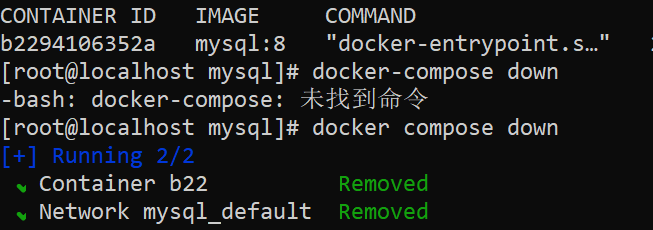

# linux-docker

### Introduction
记录一下学习部署的过程和某些步骤中需要注意的地方~

### some useful commands

- `sudo -i` 切换成超级管理员
- `systemctl stop firewalld` 关掉防火墙
- `systemctl start docker` 启动docker
- `systemctl status docker` 查看docker运行状态
- ` docker images` 查看所有镜像
- cd + 空格 + 目录, 如 ` cd /home/services/mysql`进入指定路径的目录,如这里就是进入mysql目录
- `cd ..`返回上一级目录，另：注意`cd`和`..`间有空格！
- `cd` 回到家目录，root目录，和`/home`不一样！可以通过`pwd`来认识它们的差距
- `cd /` 回到根目录
- `pwd` 查看当前完整目录
- `ls` 查看当前路径下的所有(未隐藏)文件
- `ls -a`查看当前目录的所有文件，包括隐藏文件
- `mkdir 目录名`创建一个新目录
- `mkdir -p 目录名1/目录名2/目录名3` 创建多级目录
- `vi 文件名` 修改文件内容(如果没有该文件会先创建出来)
- `i` （文件内操作）执行修改，进入修改文件模式
- esc键 （文件内操作）退出修改模式,进入命令模式
- `:wq` （文件内操作）（命令模式下）保存修改并退出
- `rm 文件名` 删除路径下的指定文件,另：在删除前可以先`ls`一下，按照查出来的信息来删，防止删错
- `rm -r 目录`删除目录
- `vi /etc/docker/daemon.json` 打开加速地址配置文件
- `systemctl start docker` 启动docker
- `systemctl restart docker` 重启docker,多用于修改加速地址配置文件后
- `docker compose -f docker-compose.yaml up -d` 启动容器
- `docker ps` 查看容器的信息
- `docker compose ps` 也是查看容器信息，查出的信息与上一条命令的其实差不多的，就是排列不一样，可以都试试看
- `docker compose -f docker-compose.yaml up -d` 启动服务容器
- `docker compose ps` 列出项目中的所有容器
- `docker logs b22`另：b22是我的容器名称 这里是查看容器日志
- `docker rename 原名称 现名称`修改容器名称，原名称可以通过`docker ps`查询到
- `docker stop 5a6`停止容器5a6运行
- `docker rm 5a6` 删除容器，先停止再删除!
- ` docker compose down` 停止并删除所有容器（包括和容器一起创建出来的相应的网络）
- `docker pull 镜像名:镜像版本号` 拉取镜像,如：`docker pull tomcat:10.1-jdk21`
- `docker rmi 镜像名:镜像版本号` 删除镜像，如:`docker rmi tomcat:8.5.46-jdk8-openjdk` 
### ordinary errors

1. ` ✘ public-mysql Error Get "https://registry-1.docker.io/v2/": dial tcp:...                     0.0s`  
  解决方法:修改DNS https://blog.csdn.net/weixin_47316183/article/details/131987609
2. `Error response from daemon: Get "https://index.docker.io/v1/search?q=tomcat&n=25": read tcp 10.0.2.15:55872->67.15.100.252:443: read: connection reset by peer`  
    这是因为很多加速地址都不可用了，可以根据以下网址选取可用加速网址重新配置。 
   https://blog.csdn.net/llc580231/article/details/139979603#:~:text=%E7%BD%91%E6%98%93%E9%95%9C%E5%83%8F%E4%B8%AD%E5%BF%83%EF%BC%9Ahtt
   `vi /etc/docker/daemon.json`将可用加速地址加入配置文件中
   `service docker restart`修改完配置文件记得重启一下docker
    
### Update

#### 2024/9/30 and 2024/10/4
部署tomcat(主要参考博客:https://cloud.tencent.com/developer/article/2292948#:~:text=%E7%AE%80%E5%8C%96%E9%83%A8%E7%BD%B2%EF%BC%9A%E9%80%9A%E8%BF%87%E5%AE%B9%E5%99%A8%E5%8C%96  

操作如下：
1. `docker search tomcat`先搜索可用的tomcat
    另：此时可能报错，详情及解决方法看错误2
   还是不行，然后，这里有好几个方法：https://cloud.tencent.com/developer/article/2434428
   亲测法一不行，华为云提供的个人镜像地址已经不可用的了(404 Not Found)。  

   法二的话.....用了点魔法在docker官网注册了账号，但是在虚拟机`docker login`的时候一直被拒绝连接。。。
   `Error response from daemon: Get "https://registry-1.docker.io/v2/": read tcp 10.0.2.15:40674->202.160.130.145:443: read: connection reset by peer
[`像这样。。。感觉是因为翻墙之类的所以被拒绝连接，，所以法二也无法探索下去。。  

   法三：照着博主的整，突然发现可以直接搜索tomcat各个版本名称。`https://docker.fxxk.dedyn.io/_/tomcat`
   这样的话是不是可以指定版本名称直接pull而不用在虚拟机search了呢？
   
2. `docker pull tomcat:10.1-jdk21` 根据操作1的法三，跳过了search的命令，直接在官网查询到合适的版本号，并进行拉取。
3.  `mkdir -p /home/yumu/services/tomcat ` 创建容器挂载目录
4.  `chmod -R 777 /home/yumu/services/tomcat/data` 查了一下，这是授予各个权限，使得所有用户都可以读取、修改和执行这个配置文件。感觉不是很安全....
5. ~~`docker run -d  --name tomcat10.1 --restart always -p 80:8080 -v /services/tomcat/data:/usr/local/tomcat/webapps/ROOT/   tomcat:10.1-jdk21`~~
6. ~~`docker rename tomcat10.1 5a6`改名~~
7. 5,6好像是直接用docker命令创建而不是使用脚本创建。为了和老师的一样，把这个新的容器给删了，把tomcat下目录data给删了，像部署mysql一样用配置文件来创建。
8. `vi tomcat-compose.yaml`把老师给的copy过去，对了要注意修改一下对应镜像等,copy完了记得检查一遍，别缺了哪个字母，特别是第一个字母，如果一开始没有按i键进入插入模式copy时就会缺第一个`s`
9. `docker compose -f tomcat-compose.yaml up -d  ` 启动容器
10. `docker rename tomcat-docker-example-1 4ac` 改名改名
#### 2024/9/28

把之前的部署mysql的容器，compose脚本都删了，系统地再完成一遍**docker compose部署mysql的过程**。  
ps：  
怎么创建的就要怎么删！如果是用docker创建的就用docker命令删除；如果是用docker compose命令或者脚本文件创建的就要用docker compose命令来删除！
假设是用docker compose创建但是是用docker命令删除就会删不干净当时同时创建的网络，会影响后面容器的创建！  
因为我是通过docker compose脚本创建的，所以要通过docker compose命令来删除：` docker compose down`  
  
删除容器后再删除相应脚本文件：
- 先进入到脚本存放目录： `cd /home/yumu/services/mysql`
- 删除前可以先看一下里面有什么 `ls`
- 删除compose脚本 `rm docker-compose.yaml`
- 删除数据 `rm -r data` 一直y加enter就完事儿了

部署前准备及须知： 
- docker启动，防火墙啥的都关掉
- 不用再下载docker-compose了，下新的docker版本的时候会把docker compose也一起下了

操作如下：
1. `mkdir -p /home/yumu/services/mysql` (如果没有的话就)创建目录，/home/用户名/services/mysql。services下按应用创建目录，即此次要创建的mysql
2. `vi docker-compose.yaml` 进入mysql目录下，在mysql下创建docker-compose.yaml文件，另，扩展名可以为yml也可以为yaml， 
它们都是yaml文件的不同扩展名，极大多数情况下没有什么差别。
   (参考博客：https://blog.csdn.net/Ber_Bai/article/details/119989755  )  
  docker-compose.yaml文件内容：https://github.com/bwhyman/linux-docker-examples/blob/master/examples/mysql/docker-compose.yaml
3. 启动容器：`docker compose -f docker-compose.yaml up -d  `
  
这里可以看到，容器启动的同时网络也创建出来了。
4. 在idea中连接测试。注：端口为主机的端口，这里主机端口多加了10000(端口映射的时候要设置好)，防止和其他任务冲突。

5. 连接好后啥也莫得，在idea创建schema，创建一个简单的user表测试使用

6. `docker ps` 查看已经创建好的容器
7. `docker rename 原名称 现名称` 重命名容器。原名可以在上一步查看，这里取当前容器id的前三个字符当新容器名
8. `docker exec -it b22 bash` 进入mysql,另，b22为我的容器名
8. `mysql -uroot -p密码` 登录mysql
9. `show databases;` 查看创建的所有数据表
10. `use schema_xin;` 使用创建的数据库
11. `show tables;` 查看数据库的数据表

12. `exit;` 退出登录
13. `exit;` 退出数据库，回到终端命令
  

#### 2024/9/24

- 端口映射，使用主机127.0.0.1的10022端口映射虚拟机xxx的22端口(ssh的默认端口);
- 创建虚拟机，在软件选择那里选择基础设施服务器，不用有附加选项。
  另：因为是基础设施服务器，一开始安装docker时指令需要自己手敲，一定要留意，要仔细。

